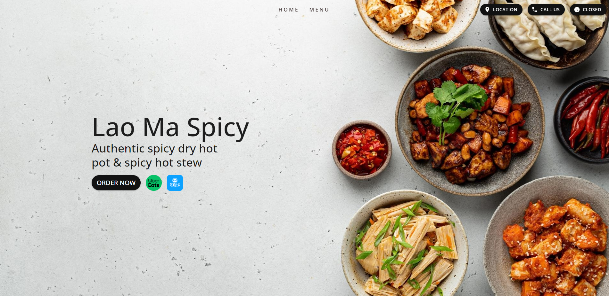
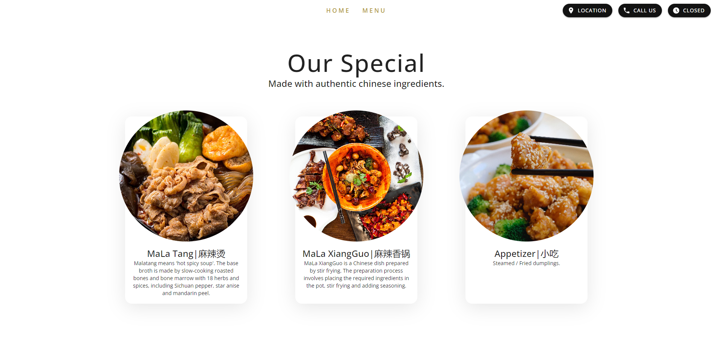
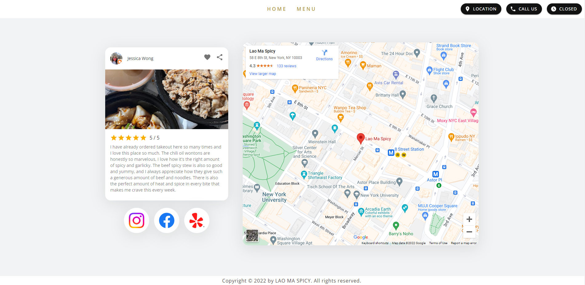
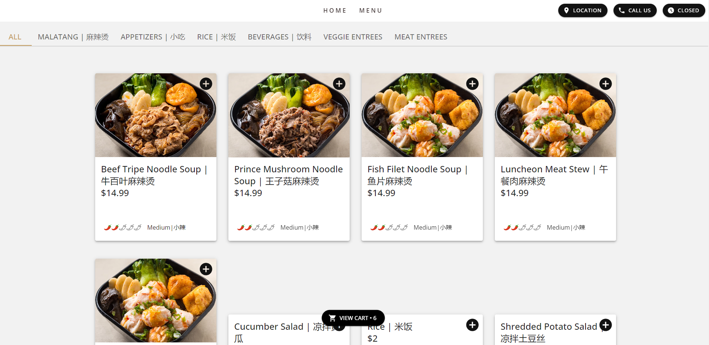
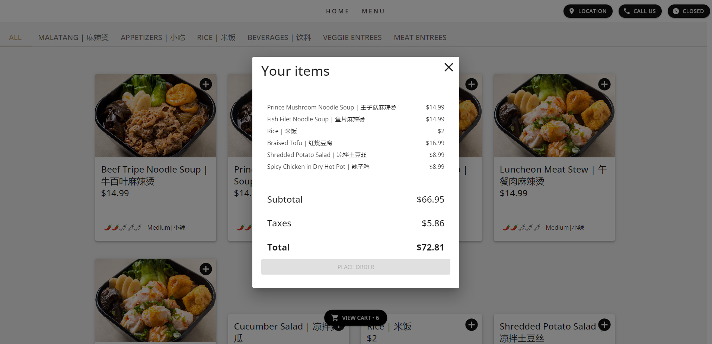

<h1 align="center"> LaoMa Spicy Official</h1>  

  

  LaoMa Spicy NYC

<!-- START doctoc generated TOC please keep comment here to allow auto update -->
<!-- DON'T EDIT THIS SECTION, INSTEAD RE-RUN doctoc TO UPDATE -->

## Table of Contents

- [Introduction](#introduction)
- [Features](#features)
- [Feedback](#feedback)
- [Build Process](#build-process)

<!-- END doctoc generated TOC please keep comment here to allow auto update -->

## Introduction

Lao Ma Spicy is an authentic chinese restaurant located in Greenwich Village, Manhattan, New York City, well knowned for its Szchuan dry hot pot & spicy hot stew. Its excellent reputation is spreaded across NYU and its adjacant neighborhoods.

  

## Features

A few hightlights:

- Order Online
- Mobile-ready responsive design
- Easy user actions with the menu and shopping cart
- Embeded Map
- Integrated Google Review API and Instagram Basic Display API to display reviews from google maps and posted media and feed from the LaoMa Spicy account.

  

  

  

  

  

  

## Feedback

Feel free to send me feedback on [Any of my Social Media Account](https://github.com/AnthonyZhang220) or [file an issue](https://github.com/AnthonyZhang220/portfolio-website/issues/new). All contributors are always welcome.

If there's anything you'd like to chat about, please feel free to join my discord [Server](https://discord.gg/xkPRmn2HRb)!

## Build Process

- Clone or download the repo
- `npm install` to install dependencies
- `npm start` to start the packager and run the app on localhost:3000
